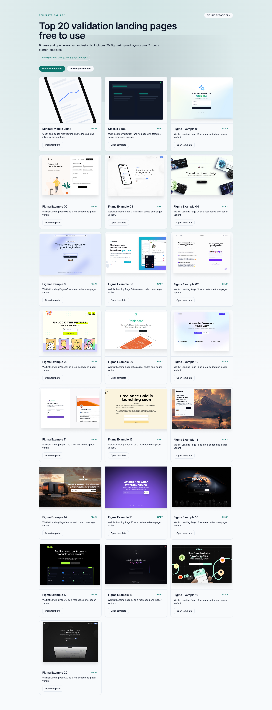
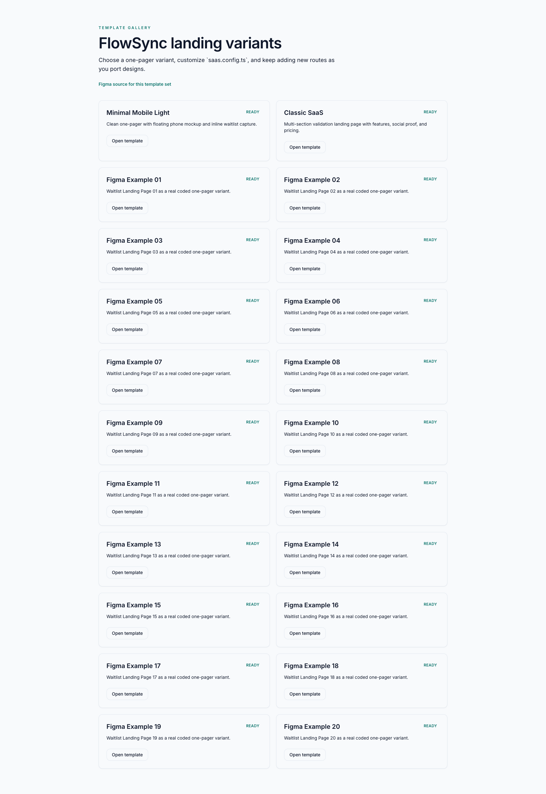
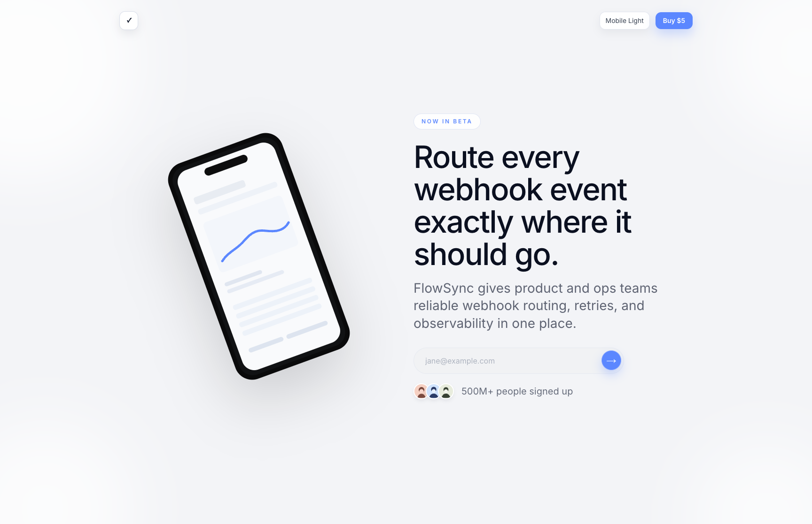
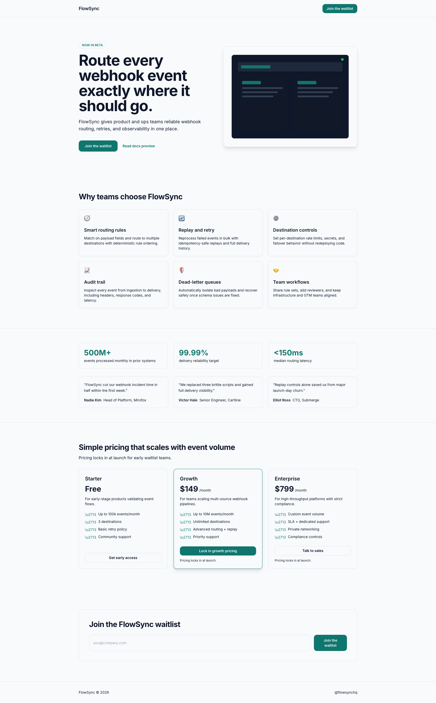
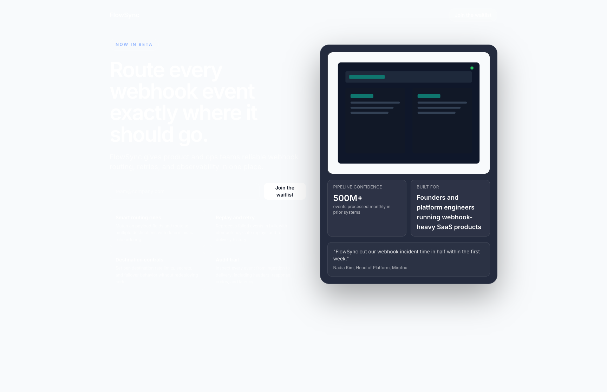

# nextjs-validation-landing-page

Top 20 validation landing pages free to use, built with Next.js 14.  
Includes 20 Figma-inspired variants plus 2 starter templates.

Repository: https://github.com/matthiasSchedel/nextjs-validation-landing-page

## What it does

- Renders a visual gallery at `/` with direct open links for each template
- Renders a list view at `/templates`
- Renders each template route at `/templates/[slug]`
- Captures waitlist emails via Resend (`/api/waitlist`)

## Gallery screenshots

### Home gallery (`/`)



### Templates index (`/templates`)



### Example template pages





## Variant routes

- `/templates/minimal-mobile-light`
- `/templates/classic-saas`
- `/templates/figma-example-01` ... `/templates/figma-example-20`

## Local development

```bash
npm install
cp .env.local.example .env.local
npm run dev
```

Required env vars:

- `RESEND_API_KEY`
- `RESEND_AUDIENCE_ID`

Optional:

- `FAL_KEY` (for `npm run generate:images`)

## Build and deploy

```bash
npm run build
npm run start
```

```bash
npm run deploy
```

Before production deployment on Vercel, add:

- `RESEND_API_KEY`
- `RESEND_AUDIENCE_ID`
- `FAL_KEY` (optional)

## License

MIT. See [LICENSE](./LICENSE).
